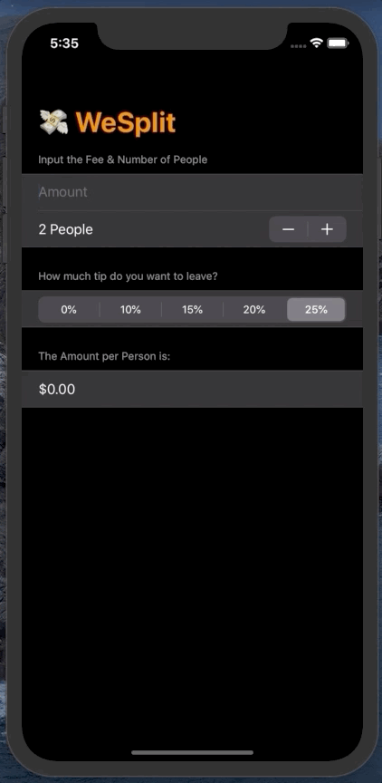

# 100DaysofSwiftUI

 

This is my repository for the course, [100 Days Of SwiftUI Challenge](https://www.hackingwithswift.com/100/swiftui) by Paul Hudson. In this repo, you can find the completed projects, which I have modified to my liking. You can find notes for the changes I made in the respective project folder.

## 1. WeSplit

## 2. Challenge 1

